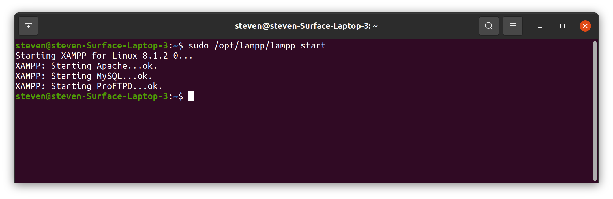
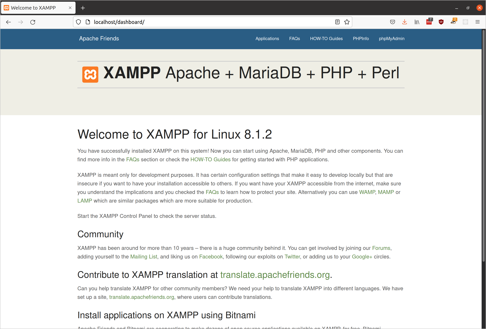
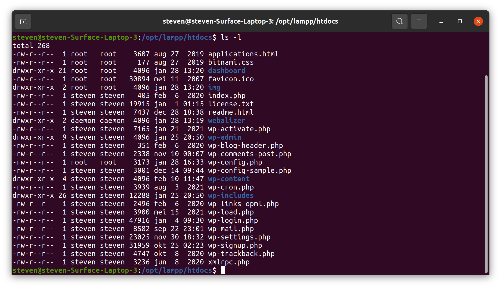
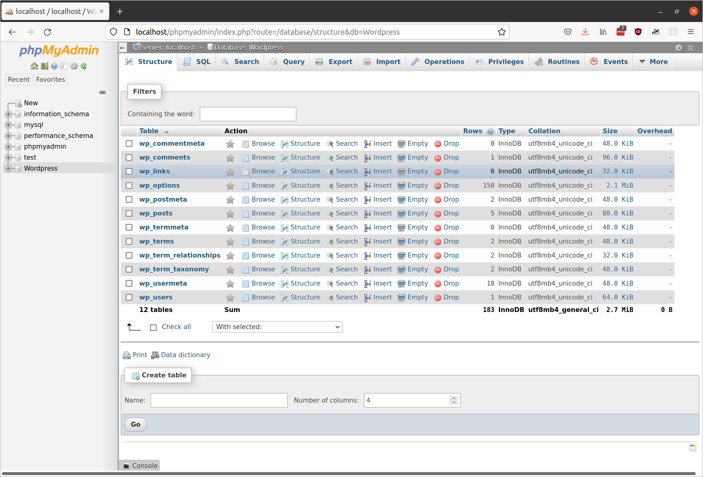
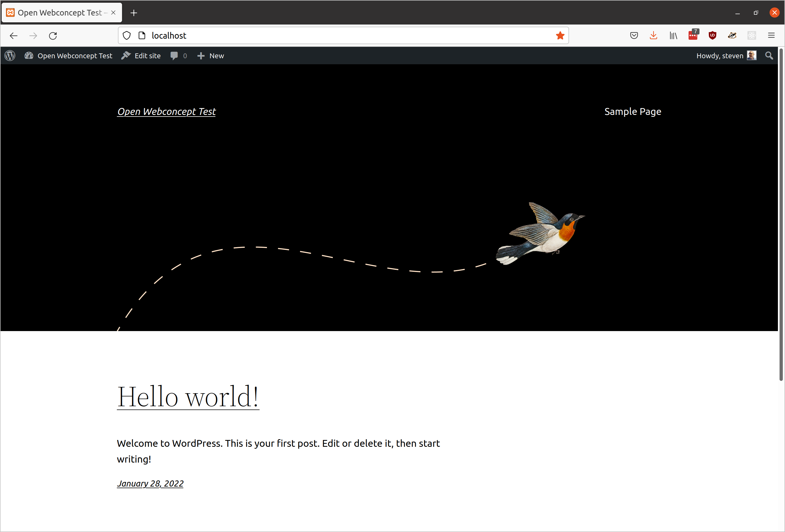
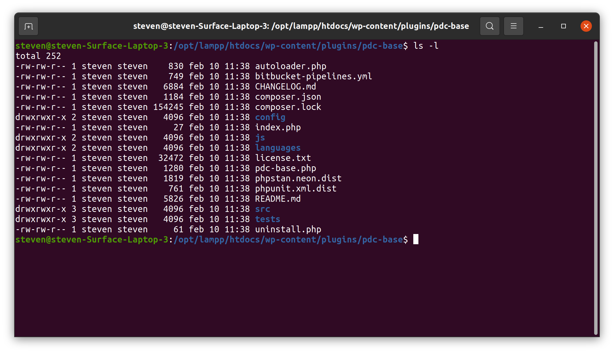
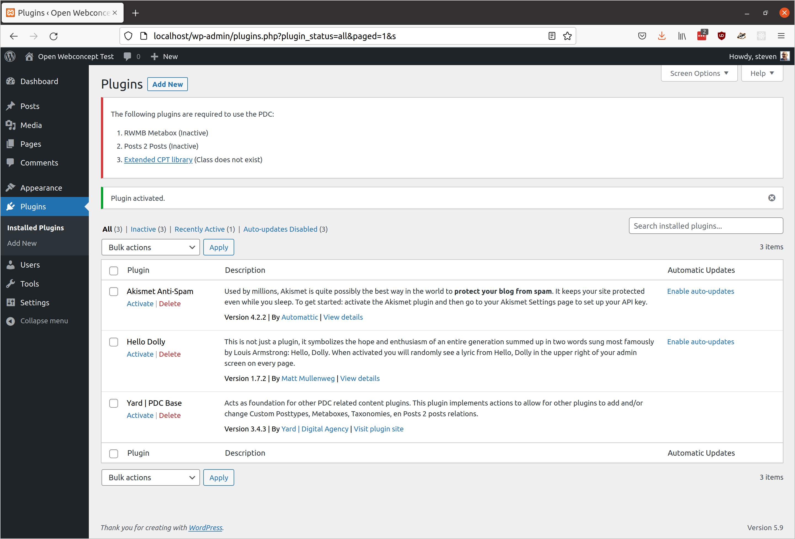

# README

### Objective

To be able to test with OpenPDC, we install a locally hosted WordPress. Below is the route followed with the result. The aim is to get a working version with which we can (help) develop a plugin for combining OpenPDC with the business rules that form the basis of the decisions and calculations for those products.

Those business rules are already available for demo purposes for one product. That product is: Individual Income Allowance. Further details can be found here.

### Locally hosted WP

The system we are installing on is Ubuntu 20.04.3 LTS. The first precondition is a local server. We install [XAMPP for Linux for that](https://www.apachefriends.org/download.html).

To start XAMPP simply call this command:
```
sudo /opt/lampp/lampp start
```


We see the XAMPP start page, as shown below.



Then WordPress was downloaded and extracted in the htdocs subdirectory where XAMPP is installed.



A WordPress database was then created with PHPMyAdmin.



After all, WordPress is installed via the installer that appears on the very first visit of the localhost.



### OpenPDC plugin

To install the OpenPDC plugin, this repository was cloned first.
After that, the entire plugin-pdc-base was copied to the plugin folder of the local WordPress installation.



When activating the plugin, a few things still go wrong. Plugins required to use the PDC are missing

* RWMB Metabox (Inactive)
* Posts 2 Posts (Inactive)
* Extended CPT library (Class does not exist)


