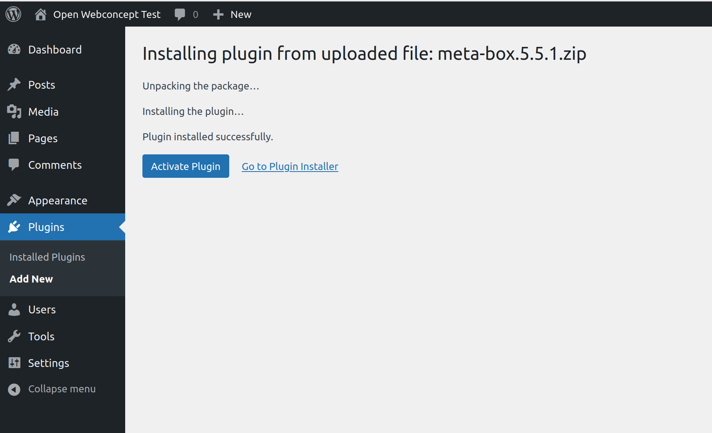

# README

### Objective

To be able to test with OpenPDC, we install a locally hosted WordPress. Below is the route followed with the result. The aim is to get a working version with which we can (help) develop a plugin for combining OpenPDC with the business rules that form the basis of the decisions and calculations for those products.

Those business rules are already available for demo purposes for one product. That product is: Individual Income Allowance. Further details can be found [here](https://commonground.gitlab.io/virtueel-inkomstenloket/regels/).

### Locally hosted WP

The system we are installing on is Ubuntu 20.04.3 LTS. The first precondition is a local server. We install [XAMPP for Linux for that](https://www.apachefriends.org/download.html).

To start XAMPP simply call this command:
```
sudo /opt/lampp/lampp start
```


We see the XAMPP start page, as shown below.


Then WordPress was downloaded and extracted in the htdocs subdirectory where XAMPP is installed.


A WordPress database was then created with PHPMyAdmin.


After all, WordPress is installed via the installer that appears on the very first visit of the localhost.


### OpenPDC plugin

To install the OpenPDC plugin, this repository was cloned first.
After that, the entire plugin-pdc-base was copied to the plugin folder of the local WordPress installation.


When activating the plugin, a few things still go wrong. Plugins required to use the PDC are missing

* RWMB Metabox (Inactive)
* Posts 2 Posts (Inactive)
* Extended CPT library (Class does not exist)


### Fixing missing plugins

#### RWMB Metabox

Downloaded latest version in zip file to uploaded from [here](https://wordpress.org/plugins/meta-box/).

However, the installation requires FTP credentials which apparently differ from the login credentials.


A possible solution that you may try to solve this “WordPress asking for FTP credentials on localhost” problem is changing the directory permission.

First, move to your installation folder. Now we’re going to modify your htdocs directory:
```
steven@steven-Surface-Laptop-3:/opt/lampp$ sudo chown -R daemon htdocs
[sudo] password for steven: 
steven@steven-Surface-Laptop-3:/opt/lampp$ sudo chmod -R g+w htdocs
steven@steven-Surface-Laptop-3:/opt/lampp$ ls -l
```

That apparently works for this localhost install.



#### Posts 2 Posts

Downloaded latest version in zip file to upload from [here](https://wordpress.org/plugins/posts-to-posts/)

Works like a charm.


#### Extended CPTs

Extended CPTs is a library which provides extended functionality to WordPress custom post types and taxonomies. This allows developers to quickly build post types and taxonomies without having to write the same code again and again.

See [here](https://github.com/johnbillion/extended-cpts) for further details.

Extended CPTs is a developer library, not a plugin, which means you need to include it as a dependency in your project.

Installing with composer didn't quite go well though.


Second attempted but still quite a few issues to fix


Replaced composer with the Ubuntu packaged version via
```
$ sudo apt install composer
```
and tried again


Problem 1 was fixed by installing the php7.x-mysql according to the version of the installed php.
```
$ sudo apt install php7.4-mysql
```
Problem 2 was solved in the same way.
```
$ sudo apt install php7.4-xml
```
And yes, the same turned out to be the solution for problem 3
```
$ sudo apt install php7.4-curl
```
New composer attempt shows that apparently the ext-zip also appears to be missing. So also installed.
```
$ sudo apt install php7.4-zip
```
Getting there. We're here now.


After upgrading composer by the [install script](https://getcomposer.org/download/).


Changed owner of composer.lock file by
```
$ sudo chown -R steven composer.lock
```
There were still permissions missing. Fixed those as well.
```
$ chmod -R 777 /opt/lampp/phpmyadmin/
$ composer require johnbillion/extended-cpts
```
Final result...


Unfortunately, the Extended CPT library is still missing (and Yes, Apache has been stopped & started).


And changing permissions didn't went well with phpMyAdmin apparently.


