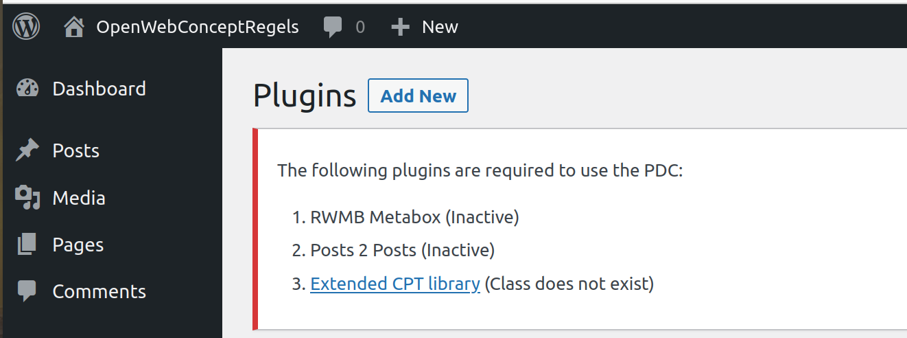
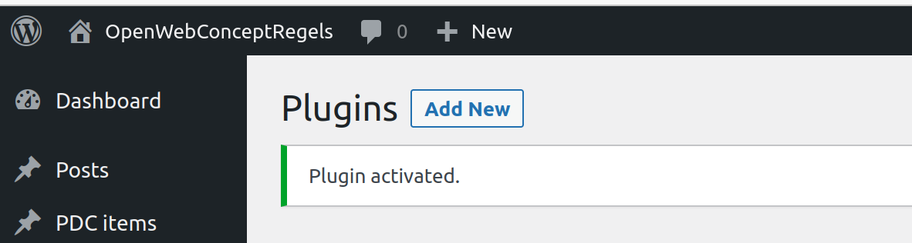

# Plugin OpenPDC Base

This repository contains the the OpenwebConcept OpenPDC plugin.

## Installation

Before installation, make sure you install following required plugins:
 - **Meta Box plugin** - Either:
   - [RWMB Metabox (free version)](https://wordpress.org/plugins/meta-box/) plus [Meta Box Group extension](https://wordpress.org/plugins/meta-box-group/), OR
   - [Meta Box AIO (premium version)](https://metabox.io/pricing/) - The all-in-one premium package that includes all Meta Box extensions
 - [Posts 2 Posts](https://wordpress.org/plugins/posts-to-posts/)

### For users
1. Download the latest release from [the releases page](https://github.com/OpenWebconcept/plugin-pdc-base/releases)
2. Unzip and move all files to the `/wp-content/plugins/pdc-base` directory.
3. Log into the WordPress admin and activate the 'Yard | OpenPDC Base' plugin through the 'plugins' menu
4. Go to the 'PDC instellingen' pagina in the left-hand menu to enter some of the required settings

### For developers
To contribute to this project, no dependencies are required. However, you will need to download [Composer](https://getcomposer.org/) to run tests or create an optimized build of the plugin.

1. Clone this repository to your machine and/or WordPress installation
2. Optionally use Composer (`composer install`) to install the dev dependencies

To create an optimized and zipped build, run the `composer run package` command. This requires `Composer`, `rsync` and `zip` to run.

### Meta Box Requirements

This plugin supports both the free and premium versions of Meta Box:

**Option 1: Free Meta Box plugins**
- Install [RWMB Metabox](https://wordpress.org/plugins/meta-box/)
- Install [Meta Box Group](https://metabox.io/plugins/meta-box-group/) (Paid extension)

**Option 2: Meta Box AIO (Premium)**
- Install [Meta Box AIO](https://metabox.io/pricing/) - includes all Meta Box functionality in one package
- No additional extensions needed

### Activation error(s)?
When activating the 'PDCBase' plugin is causing the following error:

 

Install one of the following Meta Box options:

**Free option:**
 - [RWMB Metabox](https://wordpress.org/plugins/meta-box/)
 - [Meta Box Group](https://metabox.io/plugins/meta-box-group/) (Paid extension)

**Premium option:**
 - [Meta Box AIO](https://metabox.io/pricing/) (includes all extensions)

Also install:
 - [Posts 2 Posts](https://wordpress.org/plugins/posts-to-posts/)

Activating the plugin after installation should fix the issue:

 

### Additional Settings

On the 'PDC instellingen' page there are 2 optional settings for extending the slug used in the 'view in portal' url.
The 'view in portal' button can be found in de wp-admin bar on the editor pages of the pdc-items or inside the 'quick edit' blocks on the overview page of pdc-items.
With these optional settings the theme and subtheme can be included into the 'view in portal' url.

Additionally, there is a possibility to use a fourth layer called 'pdc-groups'. The hierarchy, when the fourth layer setting is checked, is pdc-theme -> pdc-subtheme -> pdc-group -> pdc-item.

Finally, pdc-items can support multiple identifications for scheduling an appointment. Currently there are meta settings for DigiD, eHerkenning and eIDAS. You can set those values in the editor of a pdc-item.

## Connections

Some connections between posttypes are required for the portal to work properly. The required connections and in the correct order when filling the website:

1. pdc-theme -> none
2. pdc-subtheme -> pdc-theme
3. pdc-group -> pdc-item, pdc-theme and pdc-subtheme (pdc-groups usage is optional)
4. pdc-item -> pdc-theme, pdc-subtheme

## Filters & Actions

There are various [hooks](https://codex.wordpress.org/Plugin_API/Hooks), which allows for changing the output.

### Action for changing main Plugin object.

```php
'owc/pdc-base/plugin'
```

See OWC\PDC\Base\Foundataion\Config->set method for a way to change this plugins config.

Via the plugin object the following config settings can be adjusted

-   metaboxes
-   p2p_connections
-   posttypes
-   rest_api_fields
-   settings
-   settings_pages
-   taxonomies

### Filters the Posts to Posts connection defaults.

```php
owc/pdc-base/p2p-connection-defaults
```

### Filters the per Posts to Posts connection, connection type args.

```php
owc/pdc-base/before-register-p2p-connection/{$posttypes_from}/{$posttypes_to]}
```

### Filters the data retrieved for this Rest API field.

```php
owc/pdc-base/rest-api/pdcitem/field/get-links
```

### Filters the data retrieved for this Rest API field.

```php
owc/pdc-base/rest-api/pdcitem/field/get-forms
```

### Filters the data retrieved for this Rest API field.

```php
owc/pdc-base/rest-api/pdcitem/field/get-downloads
```

### Filters the data retrieved for this Rest API field.

```php
owc/pdc-base/rest-api/pdcitem/field/get-title-alternative
```

### Filters the data retrieved for this Rest API field.

```php
owc/pdc-base/rest-api/pdcitem/field/get-appointment
```

### Filters the data retrieved for this Rest API field.

```php
owc/pdc-base/rest-api/pdcitem/field/get-featured_image
```

### Filters the data retrieved for this Rest API field.

```php
owc/pdc-base/rest-api/pdcitem/field/get-taxonomies
owc/pdc-base/core/posttype/posttypes/pdc_item/get-taxonomies/taxonomy-ids
```

### Filters the data retrieved for this Rest API field.

```php
owc/pdc-base/rest-api/pdcitem/field/get-connections
```

### Filters the data retrieved for this Rest API field.

```php
owc/pdc-base/rest-api/pdcsubcategory/field/has-report
```

### Filters the data retrieved for this Rest API field.

```php
owc/pdc-base/rest-api/pdcsubcategory/field/has-appointment
```

### Filters the metaboxes to be registered just before registration.

```php
owc/pdc-base/before-register-metaboxes
```

### Filters the settings to be registered just before registration.

```php
owc/pdc-base/before-register-settings
```

#### Allow additional actions before and after the creation of a featured image.

```php
owc/pdc-base/rest-api/shared-items/field/before-creation-featured-image
owc/pdc-base/rest-api/shared-items/field/after-creation-featured-image
```

## Translations

If you want to use your own set of labels/names/descriptions and so on you can do so.
All text output in this plugin is controlled via the gettext methods.

Please use your preferred way to make your own translations from the /wp-content/plugins/pdc-base/languages/pdc-base.pot file

Be careful not to put the translation files in a location which can be overwritten by a subsequent update of the plugin, theme or WordPress core.

We recommend using the 'Loco Translate' plugin.
https://wordpress.org/plugins/loco-translate/

This plugin provides an easy interface for custom translations and a way to store these files without them getting overwritten by updates.

For instructions how to use the 'Loco Translate' plugin, we advice you to read the Beginners's guide page on their website: https://localise.biz/wordpress/plugin/beginners
or start at the homepage: https://localise.biz/wordpress/plugin

## Running tests

To run the Unit tests go to a command-line.

```bash
cd /path/to/wordpress/htdocs/wp-content/plugins/pdc-base/
composer install
composer unit
```

For code coverage report, generate report with command line command and view results with browser.

```bash
composer unit-coverage
```

## Contribution guidelines

### Writing tests

Have a look at the code coverage reports to see where more coverage can be obtained.
Write tests.
Create a Pull request to the OWC repository.

### Who do I talk to?

If you have questions about or suggestions for this plugin, please contact <a href="mailto:hpeters@buren.nl">Holger Peters</a> from Gemeente Buren.
